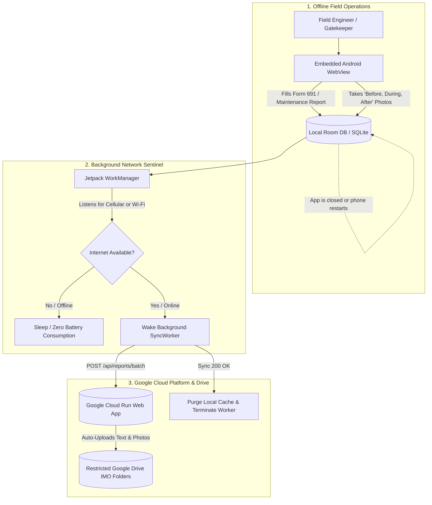

# NIA Region IV-B (MIMAROPA) O&M GIS System
## Android Companion Mobile App — Master Specification & Kickoff Prompt

---

### 📋 Overview for Future Antigravity Agent
This document serves as the **complete architectural context and implementation prompt** for creating the **Offline-First Companion Android App (or Hybrid Wrapper with Background Sync)** for the **National Irrigation Administration (NIA) Regional Office No. IV-B (MIMAROPA)** Operations & Maintenance (O&M) GIS and Field Reporting Web Platform.

When the web application is deployed to **Google Cloud Run**, this Android companion app will be built in the duplicated workspace to empower field engineers and ditchtenders to work seamlessly in remote, zero-connectivity irrigation zones.

---

## 🎯 Primary Purpose & Functional Requirements



### Core Requirements:
1. **Dedicated Full-Screen WebView Container**:
   - Runs the deployed Google Cloud Run web app with native performance, full offline asset caching, and responsive UI scaling.
   - Provides native hardware hooks for **GPS Location Capture** and **Camera / Gallery Picker**.

2. **Persistent Local Database (Room / SQLite)**:
   - Stores offline reports, stationing reaches (`Sta. 0+000 to Sta. 0+500`), desilting volumes ($m^3$), status logs, and Base64/binary photo attachments safely on the device.
   - Guaranteed persistence across **app force-closures, battery exhaustion, and phone reboots**.

3. **Autonomous Background Sync (`Jetpack WorkManager`)**:
   - Uses `Constraints.Builder().setRequiredNetworkType(NetworkType.CONNECTED).build()`.
   - **Silent Background Execution**: Wakes up automatically in the background when the user returns to an internet area (Wi-Fi or Mobile Data).
   - Syncs all queued offline reports to the Cloud Run `/api/reports/batch` API.
   - Cleans up synced records and gracefully shuts down without requiring manual user input.

4. **Lifecycle & Startup Auto-Sync**:
   - If the app was closed between report creation and network reconnection, it immediately detects pending reports on the next app startup or phone reboot (`BootReceiver`) and triggers the sync worker.

---

## 🔌 API & Data Contract

### Deployed Web App Endpoints (Google Cloud Run):
- **Batch Sync**: `POST /api/reports/batch`
  - Body: `{ reports: [ FieldReport, ... ] }`
  - Response: `{ success: true, syncedCount: number, totalReports: number }`
- **Single Report Submission**: `POST /api/reports`
- **Fetch Reports**: `GET /api/reports?role=...&imo=...&timeScope=...`
- **Fetch GIS Vector Layers**: `GET /api/drive/imo-layers`

### Key Data Entities:
- **`FieldReport`**:
  - `id`: Unique client UUID (e.g. `rep-1786871234567`)
  - `title`, `description`, `reporterName`, `imoOffice` (MOMARO, Occidental Mindoro, Palawan, Regional Office IV-B), `systemName` (NIS RIS)
  - `reportType`: `'maintenance'` | `'operational_status'`
  - `stationStart`, `stationEnd`, `desiltingVolume`, `status`, `approvalStatus`
  - `photos`: `Array<{ id, url, caption, timestamp, stage, coordinates }>`
  - `location`: `{ latitude, longitude }`
  - `synced`: `boolean`

---

## 🛠️ Android Tech Stack & Component Blueprint

| Component | Technology | Responsibility |
| :--- | :--- | :--- |
| **Language** | Kotlin | Modern, concise, null-safe Android development |
| **Architecture** | MVVM + Jetpack | Industry standard clean separation of concerns |
| **Local Database** | Room Database (SQLite) | Persistent local storage for offline reports & photos |
| **Background Sync** | AndroidX WorkManager | Reliable background network scheduling & execution |
| **Network Client** | Retrofit 2 + OkHttp 3 | Robust HTTP client for Cloud Run communication |
| **UI Container** | AndroidX WebKit (WebView) | Hardware-accelerated full-screen container |
| **Boot Sentinel** | BroadcastReceiver (`BootReceiver`) | Re-enqueues sync worker upon device reboot |

---

## 📋 COPY-PASTE KICKOFF PROMPT FOR FUTURE DUPLICATED WORKSPACE

*Copy the prompt block below and paste it directly into your new Antigravity chat in the duplicated project workspace:*

```markdown
Hello Antigravity! 

I have duplicated my NIA Region IV-B (MIMAROPA) Operations & Maintenance GIS and Field Reporting Web Platform, which is now deployed on Google Cloud Run.

I want you to build the **Offline-First Companion Mobile Android App (Hybrid Wrapper with Background Sync)** for this project.

### System Overview & Goals:
1. **Web App URL**: Connects to our deployed Google Cloud Run instance (and fallback local address during development).
2. **Target Audience**: Field Engineers, Water Resources Facilities Operators (WRFOs), and Gatekeepers in remote MIMAROPA irrigation systems (MOMARO, Occidental Mindoro, Palawan).
3. **Core Functionality**:
   - **Hardware-Accelerated Full-Screen WebView**: Embeds the web app with support for camera capture, photo uploads, and geolocation.
   - **Local Room Database (SQLite)**: Stores field reports, canal stationing records, and photo attachments locally while the engineer is offline in remote canals.
   - **Background Sync Engine (Jetpack WorkManager)**:
     - Automatically listens for network availability (`NetworkType.CONNECTED`).
     - When internet is detected (even if the app is in the background or closed), it wakes a background `SyncWorker`, pushes all queued offline reports to the backend (`/api/reports/batch`), updates local sync statuses, and terminates silently.
   - **Reboot & Startup Resilience**:
     - Uses a `BootReceiver` and `MainActivity` lifecycle checks so that queued offline reports are never lost if the phone restarts or the app is killed.
   - **JavaScript Bridge**: Provides a two-way `JavascriptInterface` between the web interface and native Android code to exchange offline status, trigger camera, and pass reports to the Room DB.

### What you should do:
1. Review the existing codebase (data models in `src/types.ts`, offline storage in `src/utils/offlineStorage.ts`, and server batch endpoints in `server.ts`).
2. Scaffold the native Android project folder (`android-companion/` or integrated root structure) with:
   - `app/build.gradle.kts` (WorkManager, Room, WebKit, Retrofit/OkHttp, Coroutines).
   - `AndroidManifest.xml` (Permissions: `INTERNET`, `ACCESS_NETWORK_STATE`, `ACCESS_FINE_LOCATION`, `CAMERA`, `RECEIVE_BOOT_COMPLETED`).
   - `MainActivity.kt` (Configured WebView, WebChromeClient, JavascriptInterface bridge).
   - `OfflineReportDatabase.kt`, `ReportDao.kt`, and `ReportEntity.kt` (Room database).
   - `SyncWorker.kt` (WorkManager CoroutineWorker for background batch sync).
   - `BootReceiver.kt` (Re-registers WorkManager sync upon device boot).
3. Provide instructions on how to build and assemble the debug `.apk` (`./gradlew assembleDebug`) and test the background sync flow.

Please start by inspecting the project and presenting the implementation plan for the Android Companion App!
```
